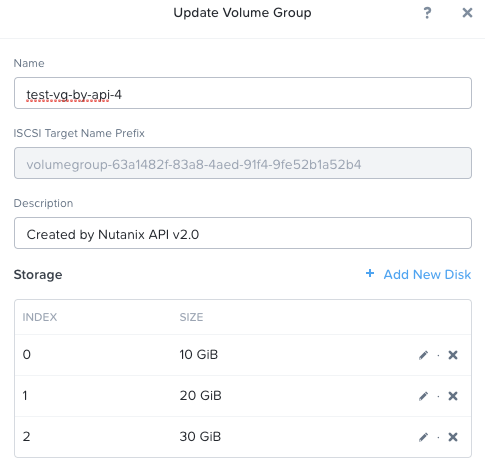
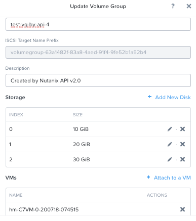

# nutanix-restapi-wrapper

## Sample API Specification

Nutanix API reference: https://www.nutanix.dev/reference/prism_element/v2/

### 1. Create a new Volume Group

#### Required parameters
* Required parameters:  
* disk_list []
   * create_spec
      * container_uuid
      * size_mb
* name

#### Sample
URL: https://xxx.xxx.xxx.xxx:9440/api/nutanix/v2.0/volume_groups/

Payload:
```
{
  "description": "Created by Nutanix API v2.0",
  "disk_list": [
    {
      "create_spec": {
        "container_uuid": "91ad254b-80f8-42e3-9d2c-a4a55884e923",
        "size_mb": 10240
      }
    },
    {
      "create_spec": {
        "container_uuid": "91ad254b-80f8-42e3-9d2c-a4a55884e923",
        "size_mb": 20480
      }
    },
    {
      "create_spec": {
        "container_uuid": "91ad254b-80f8-42e3-9d2c-a4a55884e923",
        "size_mb": 30720
      }
    }
  ],
  "name": "test-vg-by-api-4"
}
```

Result:



### 2. Attach a Volume Group to a VM

#### Required Parameters

* operation: ATTACH (Fixed value)
* uuid: uuid of volume group
* vm_uuid

#### Sample
URL: https://xxx.xxx.xxx.xxx:9440/api/nutanix/v2.0/volume_groups/{uuid}/attach

Payload:
```
{
  "operation": "ATTACH",
  "uuid": "63a1482f-83a8-4aed-91f4-9fe52b1a52b4",
  "vm_uuid": "0262fc6a-8e4b-498c-81b6-6f2a21e5e3af"
}
```

Result:



### 3. Add Disks to an existing Volume Group

#### Required Parameters

* create_spec
  * container_uuid
  * size_mb
* volume_group_uuid

#### Sample
URL: https://xxx.xxx.xxx.xxx:9440/api/nutanix/v2.0/volume_groups/{volume_group_uuid}/disks

Payload
```

{
  "create_spec": {
    "container_uuid": "91ad254b-80f8-42e3-9d2c-a4a55884e923",
    "size_mb": 40960
  },
  "volume_group_uuid": "63a1482f-83a8-4aed-91f4-9fe52b1a52b4"
}
```
